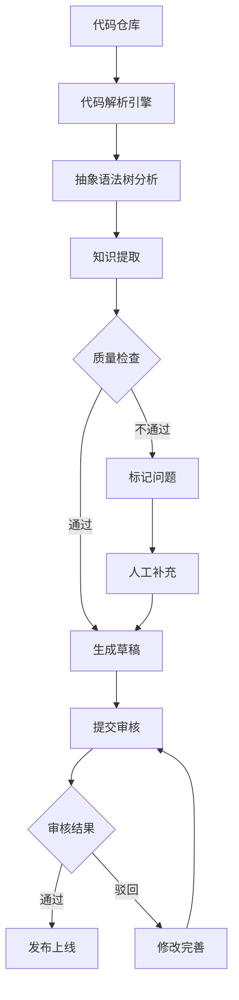

# 企业级知识库管理系统 - 产品需求文档

## 1. 产品概述

一款面向地域-系统-模块-应用层级结构的企业级知识库管理系统，通过 AI 自动分析代码生成结构化知识文档，支持知识图谱可视化和团队协作审批流程。

**核心价值**：将代码库中的隐性知识显性化，让团队成员快速理解每个应用的技术架构、业务流程和依赖关系。

**目标用户**：开发团队、技术管理者、运维人员、测试工程师

---

## 2. 核心功能模块

### 2.1 用户角色

| 角色 | 权限范围 |
|------|----------|
| 知识管理员 | 知识库全生命周期管理、审批流程、用户权限管理 |
| 技术专家 | 知识创建、编辑、发布建议 |
| 普通开发者 | 浏览知识库、参与评论讨论 |
| 审核员 | 知识内容审核、版本管理 |

### 2.2 功能架构

```
企业知识库管理系统
├── 知识域管理
│   ├── 地域管理（Region）
│   ├── 系统管理（System）
│   ├── 模块管理（Module）
│   └── 应用管理（Application）
├── 智能知识生成
│   ├── 代码解析引擎
│   ├── 文档自动生成
│   └── 知识提取算法
├── 知识图谱中心
│   ├── 代码图谱
│   ├── 接口图谱
│   ├── 测试图谱
│   └── 运维图谱
├── 协作与审批
│   ├── 知识提交审核
│   ├── 版本管理
│   ├── 评论讨论
│   └── 团队空间
└── 知识检索
    ├── 全文搜索
    ├── 智能推荐
    └── 图谱查询
```

---

## 3. 页面功能详情

### 3.1 仪表盘首页

| 模块 | 功能描述 |
|------|----------|
| 知识概览 | 展示知识库总数、今日更新、待审核内容、热门知识 |
| 知识域树 | 左侧层级导航，支持地域→系统→模块→应用的树形展开 |
| 快速入口 | 快捷访问最近浏览、收藏知识、待办审核 |
| 知识图谱概览 | 可视化展示知识关联热力图 |
| 活动动态 | 实时显示团队知识更新动态 |

### 3.2 知识域管理页

| 模块 | 功能描述 |
|------|----------|
| 层级树视图 | 拖拽式层级管理，支持增删改 |
| 批量导入 | 支持 Excel 模板批量导入知识域 |
| 应用详情卡 | 展示应用基本信息、负责人、知识数量 |
| 关联管理 | 管理应用间依赖关系 |

### 3.3 知识详情页

| 模块 | 功能描述 |
|------|----------|
| 工程说明书 | 自动生成的文档：功能概述、模块结构、核心流程 |
| API 文档 | 接口列表、调用示例、参数说明 |
| 数据字典 | 表结构、字段说明、数据类型 |
| 组件依赖 | 公共组件列表、版本信息 |
| 问题追踪 | 历史问题记录、解决方案汇总 |
| 版本对比 | 文档版本差异对比 |
| 操作日志 | 记录所有修改历史 |

### 3.4 知识图谱页

| 模块 | 功能描述 |
|------|----------|
| 代码图谱 | 函数关系、模块依赖、调用链路可视化 |
| 接口图谱 | 上下游系统关系、数据流向 |
| 测试图谱 | 需求-代码-测试用例-缺陷关联 |
| 运维图谱 | 告警-日志-链路-故障根因关系 |
| 交互查询 | 点击节点展开详情、路径高亮 |
| 导出功能 | 支持导出 PNG/SVG 格式 |

### 3.5 协作空间页

| 模块 | 功能描述 |
|------|----------|
| 团队管理 | 团队成员、角色分配、权限设置 |
| 知识分享 | 发布知识到团队空间 |
| 讨论区 | 针对知识的评论和讨论 |
| 协同编辑 | 多人实时编辑文档 |
| 审核队列 | 待审核知识列表、处理操作 |

### 3.6 智能分析页

| 模块 | 功能描述 |
|------|----------|
| 代码扫描 | 输入代码仓库，自动分析提取知识 |
| 知识生成进度 | 展示分析进度、生成结果预览 |
| 知识质量评分 | AI 评估知识完整度、准确度 |
| 相似知识推荐 | 发现重复或相似知识 |

---

## 4. 核心业务流程

### 4.1 知识生成流程



### 4.2 知识图谱构建流程


---

## 5. 用户界面设计

### 5.1 设计风格

**美学方向**：科技感企业级设计，融合数据可视化的专业气质

- **主色调**：深蓝 #1a365d（权威、专业）
- **辅助色**：青色 #0891b2（科技、创新）
- **强调色**：琥珀色 #f59e0b（警示、重要）
- **成功色**：翠绿 #10b981（通过、成功）
- **背景色**：深灰 #0f172a / 浅灰 #f8fafc

**字体选择**：
- 标题：Source Han Sans SC（思源黑体）或 Noto Sans SC
- 正文：Inter 或 Roboto
- 代码：JetBrains Mono 或 Fira Code

**布局风格**：
- 左侧固定导航 + 右侧内容区
- 卡片式信息展示
- 响应式设计，支持 1440px+ 宽屏

### 5.2 交互设计

| 交互类型 | 实现方式 |
|----------|----------|
| 页面切换 | 淡入淡出 + 轻微缩放 |
| 数据加载 | 骨架屏占位 |
| 悬停效果 | 卡片阴影加深 + 边框高亮 |
| 拖拽操作 | 实时反馈 + 位置指示 |
| 图谱交互 | 力导向布局 + 节点放大 |
| 通知提示 | Toast 消息 + 右上角弹出 |

### 5.3 响应式策略

- 桌面优先设计（1440px+）
- 平板适配（768px-1439px）：侧边栏折叠
- 移动端适配（<768px）：底部导航 + 单列布局

---

## 6. 数据统计与指标

| 指标 | 描述 |
|------|------|
| 知识总数 | 当前知识库中的知识条目数 |
| 应用覆盖率 | 已录入知识的应用占比 |
| 审核通过率 | 提交知识中审核通过的比例 |
| 用户活跃度 | 每日/周/月活跃用户数 |
| 知识完整度 | 单个应用知识的平均完整度评分 |
| 检索命中率 | 搜索结果点击率 |

---

## 7. 成功标准

1. ✅ 支持地域-系统-模块-应用四级知识层级管理
2. ✅ 自动解析代码生成工程说明书
3. ✅ 可视化展示代码、接口、测试、运维四类知识图谱
4. ✅ 支持知识提交、审核、发布全流程
5. ✅ 团队协作编辑和评论功能
6. ✅ 完整的知识检索和推荐系统
7. ✅ 响应式设计，适配多端设备
