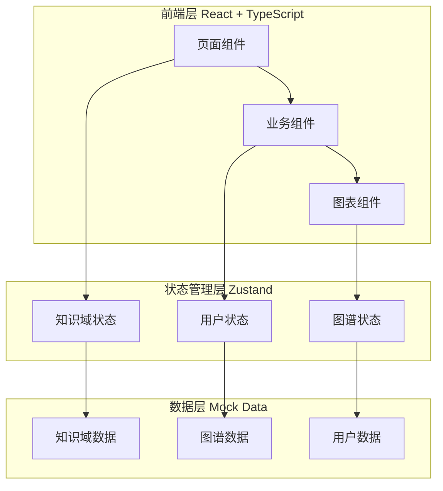

# 企业级知识库管理系统 - 技术架构文档

## 1. 架构设计



**技术选型**：
- **前端框架**：React 18 + TypeScript
- **构建工具**：Vite
- **样式方案**：Tailwind CSS
- **状态管理**：Zustand
- **路由管理**：React Router v6
- **图表库**：D3.js（知识图谱）、ECharts（数据图表）
- **图标库**：Lucide React
- **动画库**：Framer Motion

---

## 2. 页面路由设计

| 路由路径 | 页面名称 | 描述 |
|----------|----------|------|
| `/` | 仪表盘 | 知识概览、快速入口、动态 |
| `/domains` | 知识域管理 | 地域-系统-模块-应用层级管理 |
| `/domains/:appId` | 应用详情 | 应用知识详情页面 |
| `/graph` | 知识图谱中心 | 四类图谱入口 |
| `/graph/code` | 代码图谱 | 代码关系可视化 |
| `/graph/interface` | 接口图谱 | 接口依赖可视化 |
| `/graph/test` | 测试图谱 | 测试关联可视化 |
| `/graph/ops` | 运维图谱 | 运维关系可视化 |
| `/collaboration` | 协作空间 | 团队管理、讨论区 |
| `/review` | 审核队列 | 待审核知识列表 |
| `/search` | 知识检索 | 搜索结果页 |
| `/settings` | 系统设置 | 用户设置 |

---

## 3. 核心组件设计

### 3.1 布局组件

| 组件 | 职责 |
|------|------|
| `Layout` | 整体布局容器 |
| `Sidebar` | 左侧导航栏 |
| `Header` | 顶部工具栏 |
| `Breadcrumb` | 面包屑导航 |

### 3.2 知识域组件

| 组件 | 职责 |
|------|------|
| `DomainTree` | 知识域树形结构 |
| `DomainCard` | 知识域卡片展示 |
| `AppDetail` | 应用详情面板 |
| `KnowledgeEditor` | 知识编辑表单 |

### 3.3 图谱组件

| 组件 | 职责 |
|------|------|
| `GraphCanvas` | 图谱画布容器 |
| `ForceGraph` | 力导向图组件 |
| `NodeTooltip` | 节点提示框 |
| `GraphControls` | 图谱控制工具 |
| `MiniMap` | 缩略图导航 |

### 3.4 协作组件

| 组件 | 职责 |
|------|------|
| `TeamMember` | 团队成员卡片 |
| `ReviewQueue` | 审核队列列表 |
| `CommentThread` | 评论线程 |
| `ActivityFeed` | 活动动态流 |

---

## 4. 数据模型设计

### 4.1 知识域实体

```typescript
interface Region {
  id: string;
  name: string;
  code: string;
  systems: System[];
}

interface System {
  id: string;
  name: string;
  code: string;
  regionId: string;
  modules: Module[];
}

interface Module {
  id: string;
  name: string;
  code: string;
  systemId: string;
  applications: Application[];
}

interface Application {
  id: string;
  name: string;
  code: string;
  moduleId: string;
  description: string;
  owner: string;
  repository: string;
  techStack: string[];
  knowledge: Knowledge;
}
```

### 4.2 知识实体

```typescript
interface Knowledge {
  id: string;
  appId: string;
  type: 'overview' | 'api' | 'schema' | 'component' | 'issue';
  title: string;
  content: string;
  status: 'draft' | 'pending' | 'approved' | 'published';
  version: number;
  createdBy: string;
  createdAt: string;
  updatedAt: string;
  reviewedBy?: string;
  reviewedAt?: string;
}
```

### 4.3 图谱实体

```typescript
interface GraphNode {
  id: string;
  type: 'function' | 'module' | 'interface' | 'table' | 'service';
  label: string;
  properties: Record<string, any>;
}

interface GraphEdge {
  id: string;
  source: string;
  target: string;
  type: 'calls' | 'depends' | 'uses' | 'extends';
  label?: string;
}

interface KnowledgeGraph {
  nodes: GraphNode[];
  edges: GraphEdge[];
}
```

---

## 5. Mock 数据策略

### 5.1 模拟数据文件

- `mock/domains.ts` - 知识域层级数据
- `mock/knowledge.ts` - 知识内容数据
- `mock/graph.ts` - 图谱节点和边数据
- `mock/users.ts` - 用户和团队数据
- `mock/activities.ts` - 活动动态数据

### 5.2 数据初始化

使用 Zustand store 配合 localStorage 实现数据持久化，支持：
- 知识域 CRUD 操作
- 知识内容更新
- 审核状态流转
- 评论和讨论

---

## 6. 关键实现说明

### 6.1 知识图谱可视化

使用 **D3.js** 实现力导向图：
- 节点大小根据重要性计算
- 边的粗细表示关系强度
- 支持拖拽、缩放、聚焦
- 点击节点展开关联详情

### 6.2 树形结构渲染

递归组件实现知识域树：
- 支持懒加载子节点
- 拖拽排序功能
- 搜索过滤高亮
- 展开/折叠动画

### 6.3 状态管理架构

```typescript
// stores/knowledgeStore.ts
interface KnowledgeStore {
  domains: Region[];
  selectedDomain: string | null;
  setDomains: (domains: Region[]) => void;
  addDomain: (domain: Region) => void;
  updateDomain: (id: string, data: Partial<Region>) => void;
  deleteDomain: (id: string) => void;
}
```

---

## 7. 性能优化策略

1. **路由懒加载**：使用 React.lazy 延迟加载页面组件
2. **虚拟列表**：长列表使用虚拟滚动
3. **图谱优化**：大图谱使用 WebWorker 计算布局
4. **缓存策略**：使用 React Query 缓存 API 数据
5. **按需加载**：图谱组件按需导入 D3 模块

---

## 8. 项目文件结构

```
src/
├── assets/              # 静态资源
├── components/           # 通用组件
│   ├── layout/          # 布局组件
│   ├── knowledge/       # 知识相关组件
│   ├── graph/           # 图谱组件
│   └── collaboration/   # 协作组件
├── pages/               # 页面组件
│   ├── Dashboard/
│   ├── Domain/
│   ├── Graph/
│   ├── Collaboration/
│   └── Settings/
├── stores/              # Zustand 状态管理
├── hooks/               # 自定义 Hooks
├── mock/                # Mock 数据
├── types/               # TypeScript 类型定义
├── utils/               # 工具函数
└── App.tsx             # 根组件
```
